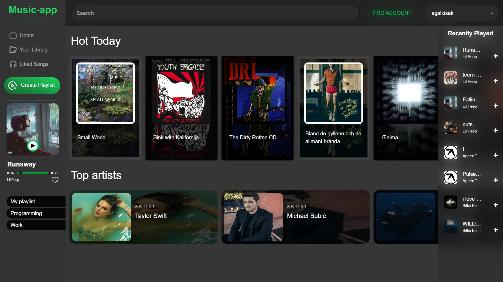
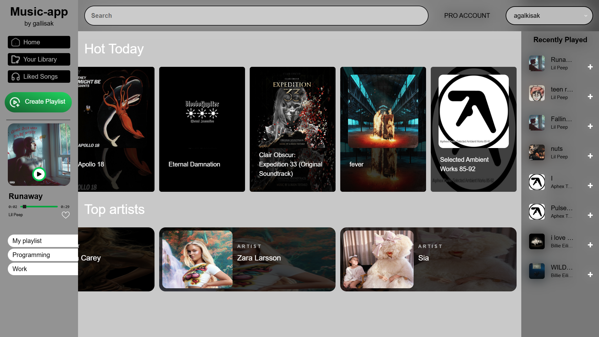

# 🎵 Music Streaming App


A modern, responsive music streaming application built with **React** and **TypeScript**. It features a fully functional music player, real-time data fetching from the Deezer API using **RTK Query**, and state management with **Redux Toolkit**.

## 🚀 Live Demo

👉 **[View Live Demo Here](https://music-app-blush-two.vercel.app)**

## ✨ Features

- **Discover Music:** Browse top charts and popular artists.
- **Music Player:** Full playback controls (Play, Pause, Next, Previous, Volume, Loop).
- **Search:** Search for songs, artists, and albums.
- **Artist Details:** View artist biography and top songs.
- **Responsive Design:** Fully optimized for mobile, tablet, and desktop.
- **State Management:** Seamless user experience using Redux Toolkit.

## 🛠 Tech Stack

- **Frontend:** React, TypeScript
- **State Management:** Redux Toolkit
- **Data Fetching:** RTK Query (RapidAPI / Deezer API)
- **Styling:** Tailwind CSS
- **Icons:** React Icons / Heroicons

## 📸 Screenshots

|              Home Page               |               Light Mode               |
| :----------------------------------: | :------------------------------------: |
|  |  |

## ⚙️ Installation & Run Locally

1.  **Clone the repository:**

    ```bash
    git clone [https://github.com/gallisak/music-app.git](https://github.com/gallisak/music-app.git)
    ```

2.  **Navigate to the project folder:**

    ```bash
    cd music-app
    ```

3.  **Install dependencies:**

    ```bash
    npm install
    # or
    yarn install
    ```

4.  **Start the development server:**
    ```bash
    npm run dev
    ```

## 🧠 What I Learned

Building this project helped me improve my skills in:

- Configuring **Redux Toolkit** for global state management.
- Handling asynchronous data fetching and caching with **RTK Query**.
- Typing props and state with **TypeScript** for better code reliability.
- Creating complex layouts using **Tailwind CSS**.

---

Designed & Developed by [Andrii Halchyshak](https://github.com/gallisak)
